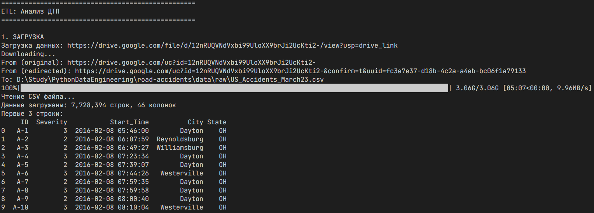
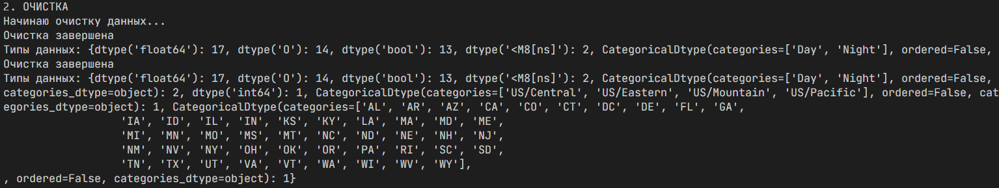
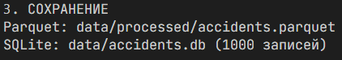

# Аналитическая платформа для снижения дорожно-транспортных происшествий

## Цель проекта
Аналитическая платформа для анализа дорожно-транспортных происшествий в США с целью выявления факторов риска и разработки превентивных мер.

## Датасет
Анализ данных о дорожно-транспортных происшествиях (US_Accidents_March23.csv).

# Руководство по обработке датасета

## Структура проекта

```
road-accidents/
├── etl/
│   ├── __init__.py
│   ├── extract.py
│   ├── transform.py
│   ├── load.py
│   └── main.py
├── notebooks/
│   └── EDA.ipynb
├── data/
│   ├── raw/
│   └── processed/
├── requirements.txt
└── README.md
```

## Создание виртуального окружения
```powershell
python -m venv .venv
.\.venv\Scripts\activate
```

## Установка зависимостей
```bash
pip install -r requirements.txt
```

## Запуск ETL

Выполнить команду
```powershell
python -m etl.main --url "https://drive.google.com/file/d/12nRUQVNdVxbi99UloXX9brJi2UcKti2-/view?usp=drive_link"
```
После запуска скрипт выполняет следующее:

## Загрузка данных с Google Drive
Сохраняет в папку ./data/raw
Отображает первые 10 строк датасета для проверки



Показывает информацию о количестве записей и типах данных



## Общая информация о датасете

- **Название:** US Accidents Dataset
- **Записей:** 7,728,394 ДТП
- **Период:** 2016-2023 гг.
- **Объём:** 3.06 GB
- **Признаки:** 46 (география, время, погода, тяжесть)

## Проведенные преобразования в ETL-процессе

### 1. (Extract) Извлечение
```python
gdown.download(f"https://drive.google.com/uc?id={file_id}", output_path, quiet=False)  
df = pd.read_csv(output_path, low_memory=False)
```

- Автоматическое определение ID файла из Google Drive ссылки  
- Сохранение в data/raw/US_Accidents_March23.csv  
- Загрузка с прогресс-баром  

### 2. Transform (Преобразование)  

Обработка временных данных:
```python
df_clean['Start_Time'] = pd.to_datetime(df_clean['Start_Time'], errors='coerce')
df_clean['End_Time'] = pd.to_datetime(df_clean['End_Time'], errors='coerce')
```

- Создание производных признаков: Start_Year, Start_Month, Start_Day, Start_Hour, Start_Weekday  

Преобразование числовых колонок:
```python
numeric_cols = ['Severity', 'Distance(mi)', 'Temperature(F)', 'Humidity(%)', 
               'Pressure(in)', 'Visibility(mi)', 'Wind_Speed(mph)', 'Precipitation(in)']
```

- Конвертация в float64 с обработкой ошибок
- Особенности:
1. Severity: уровень тяжести аварии (1-4)  
2. Distance(mi): длина затронутого участка дороги  
3. Погодные параметры с единицами измерения  

Категориальные данные:
```python
categorical_cols = ['State', 'City', 'County', 'Timezone', 'Weather_Condition', 
                   'Sunrise_Sunset', 'Civil_Twilight']
```

- Конвертация в тип category для колонок с <100 уникальных значений  
- State: 49 категорий (все штаты США)  
- Timezone: 4 категории (US/Central, US/Eastern, US/Mountain, US/Pacific)  
- Sunrise_Sunset: 2 категории (Day, Night)  

### 3. Load (Загрузка)

```python
sample_df = df.head(1000).copy()
sample_df.to_sql('accidents', engine, if_exists='replace', index=False)
```

- Первые 1000 записей для быстрого тестирования  
- SQL-доступ через sqlite:///data/accidents.db  

## Результаты оптимизации

До обработки (CSV):  

- Формат: CSV, 3.06 GB  
- Все колонки: строковый формат (object)  

После обработки:  

Типы данных в processed/accidents.parquet:  
- datetime64[ns]:   2 колонки    (Start_Time, End_Time)  
- int64:            1 колонка    (Severity)  
- float64:          17 колонок   (числовые параметры и координаты)  
- bool:             13 колонок   (флаги условий: Amenity, Bump, Crossing, etc.)  
- category:         7 колонок    (State, City, County, Timezone, etc.)  
- object:           14 колонок   (ID, Description, Street, Zipcode, etc.)  

## Загрузка в БД

Загружает первую 1000 строк в базу данных



## EDA

Анализ и работа с данными в EDA представлены в файле [EDA.ipynb](./notebooks/EDA.ipynb)


